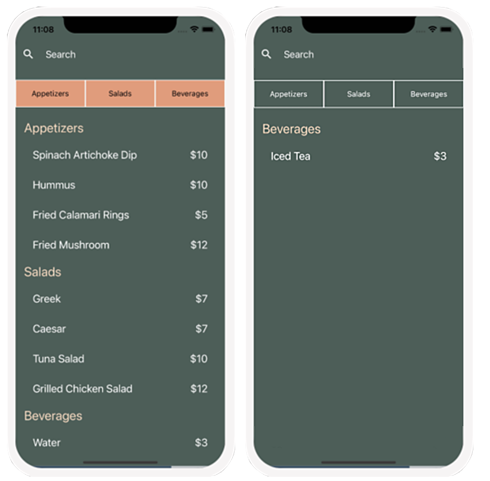

# Working with data META MOOC final project

### The purpose of the final project assessment

The primary purpose of this graded assessment is to check your knowledge and understanding of the key learning objectives of the course you have just completed.

Most importantly, graded assessments help you establish which topics you have mastered, and which topics require further focus before completing the course.

Ultimately, this graded assessment is designed to help you make sure that you can apply what you have learned. This assessment's learning objectives include being able to fetch data from the network, store data in a database as a table, and extract the data for use within React Native.

### What to expect from the final project

You have encountered exercises, knowledge checks, in-video questions, and other assessments throughout this course.

Now, you will combine the skills and knowledge that you applied at these checkpoints and use them to populate a React Native mobile application with data retrieved from an online source.

This graded assessment will task you with creating a menu app for the Little Lemon restaurant. It will display the list of items that are available to order, and users can customize it by enabling filters to show only specified categories of items, or by using the search feature to locate items by name.

The images below demonstrate how the completed app would appear:

You will be provided with some starter code that establishes the app layout; however, it is missing the list of menu items.

You will need to make a network call to fetch this data from a URL that is provided in the task instructions. Once retrieved, this data should then be stored in an SQLite database.

In order to display the data within the app, you will need to write some code that converts the data into a proper format for React Native.

Finally, you will implement some SQL transactions to enable the sorting and filtering of the data.
